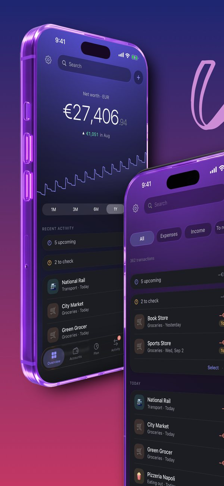
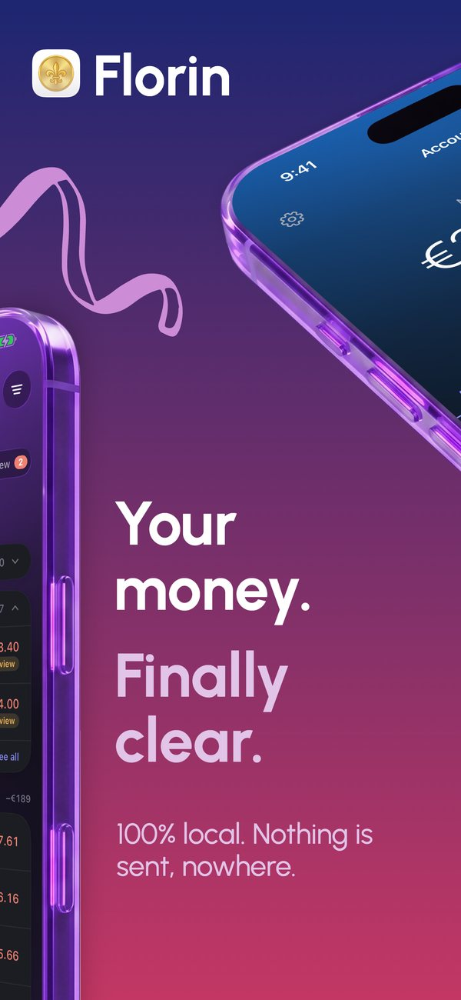
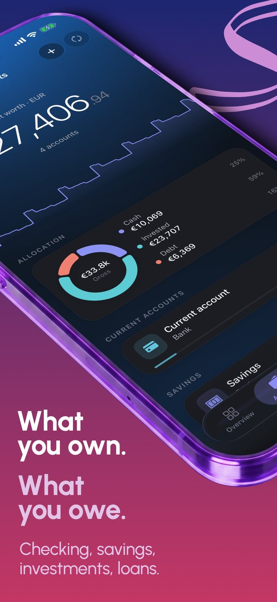
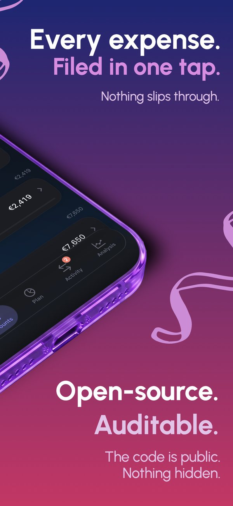
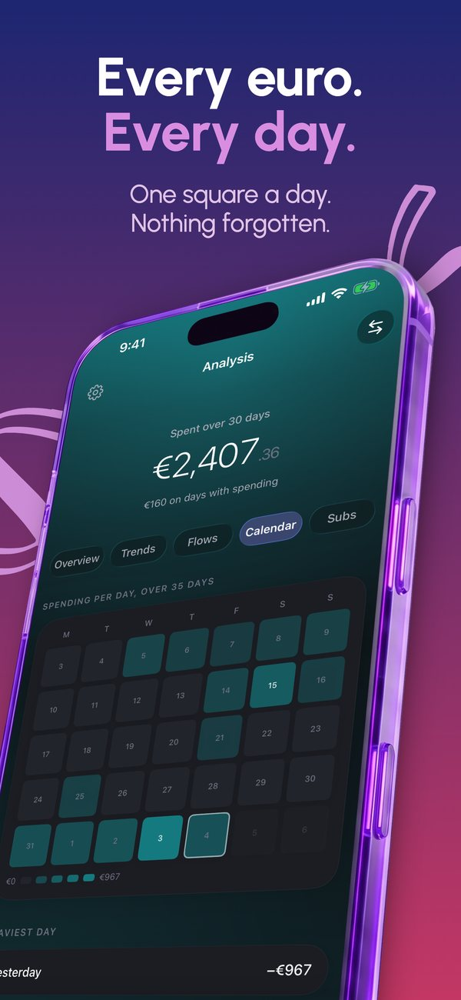

<p align="center">
  
</p>

<h1 align="center">Florin</h1>

<p align="center">
  <b>Personal finance that stays on your own devices.</b><br>
  Budget, bank sync, net worth and investments — on iPhone, Mac and your own server.
</p>

<p align="center">
  <a href="https://github.com/adrbn/florin/releases/latest"></a>
  <a href="https://github.com/adrbn/florin/actions/workflows/ci.yml"></a>
  <a href="./LICENSE"></a>
  
</p>

<p align="center">
  
  
  
  
  
</p>

<p align="center">
  <a href="#download">Download</a> ·
  <a href="#features">Features</a> ·
  <a href="#get-started">Get started</a> ·
  <a href="#connect-a-bank">Connect a bank</a> ·
  <a href="#contributing">Contributing</a>
</p>

---

## Why Florin

- 🔒 **Your data never leaves your devices.** No Florin account, no Florin server, no analytics, no tracking SDK.
- 🏦 **Real bank sync, under your own credentials.** PSD2 access to 2 000+ European banks through [Enable Banking](https://enablebanking.com/) — your own free registration, not a shared key.
- 🎯 **Figures that match the bank.** Loans follow a real amortisation schedule; savings rates count complete months only; when a number cannot be computed honestly, Florin says so instead of showing zero.
- 🗂️ **A budgeting workflow, not a chart gallery.** A monthly plan in category groups and a review queue that learns from how you file your own history.
- 📈 **Everything in one place.** Current accounts, savings, loans and a stock portfolio, in one net worth.
- 🧾 **Open source, AGPL-3.0.** Read it, run it, fork it.

## Download

| Platform | Get it | Notes |
| --- | --- | --- |
| **iPhone** | App Store — *in review* | Meanwhile: [TestFlight](apps/ios/TESTFLIGHT.md) or the [sideloadable `.ipa`](#iphone) |
| **Mac** | [`Florin-*-arm64.dmg`](https://github.com/adrbn/florin/releases/latest) | Signed, notarised, updates itself |
| **Self-hosted** | [`Florin-*-server.tar.gz`](https://github.com/adrbn/florin/releases/latest) | `docker compose up -d` — see [below](#self-hosted) |

Nothing to sign up for, anywhere. Want to look around first? The iPhone app has a **demo** on its first screen, with invented accounts you can erase from Settings.

## Features

|  | iPhone | Mac | Web |
| --- | :---: | :---: | :---: |
| **Budgeting** | | | |
| What's left to spend this month, and the daily pace it allows | ✅ | ✅ | ✅ |
| Month-end projection that narrows as the month fills | ✅ | ✅ | ✅ |
| Monthly plan in category groups, carried over from last month | ✅ | ✅ | ✅ |
| Review queue that learns from your own filing | ✅ | ✅ | ✅ |
| Create, rename and remove categories | ✅ | ✅ | ✅ |
| Rename a merchant once — the bank's label, shown your way | ✅ | — | — |
| **Money in** | | | |
| PSD2 bank sync through your own Enable Banking app | ✅ | ✅ | ✅ |
| CSV / OFX import that reads real French, German and English exports | ✅ | ✅ | ✅ |
| Manual entry and transfers between your own accounts | ✅ | ✅ | ✅ |
| YNAB-style spreadsheet import | — | — | ✅ |
| **Wealth** | | | |
| Loans on a real amortisation schedule | ✅ | ✅ | ✅ |
| Holdings with cost basis, gain, and opt-in live quotes | ✅ | ✅ | ✅ |
| Net worth over time, allocation, rolling savings rate | ✅ | ✅ | ✅ |
| Balance corrections booked as visible adjustments | ✅ | ✅ | ✅ |
| **Living with it** | | | |
| Hide every amount in one gesture | ✅ | ✅ | ✅ |
| Face ID / PIN lock | ✅ | ✅ | — |
| Home-screen widget / menu-bar widget | ✅ | ✅ | — |
| One morning notification, never one per transaction | ✅ | — | — |
| Languages | 6 | 3 | 3 |

iPhone: English, French, Dutch, Italian, Spanish, Catalan. Mac and web: English, French, Dutch.

## Get started

### iPhone

Open the app and pick how to start: connect a bank, enter accounts by hand, import a statement, restore a backup — or **Try the demo**. Everything lives in a SQLite ledger on the phone, included in its iCloud backup. It can also act as a client of your own Florin server (Settings → *Use my Florin server*).

<details>
<summary><b>Sideload, TestFlight, or build it yourself</b></summary>

- **Sideload.** Each release carries `Florin-<version>-unsigned.ipa`, re-signed on the way in with your own Apple ID by [AltStore](https://altstore.io), [SideStore](https://sidestore.io) or [Sideloadly](https://sideloadly.io). A free Apple ID re-signs for seven days at a time.
  - Bank sync needs an Associated Domains entitlement, which a free Apple ID cannot declare: host your own `apps/site/.well-known/apple-app-site-association` and point `BankingFlow.redirectHost` and `project.yml` at it.
  - Notifications and background refresh are gated the same way.
- **TestFlight.** Properly signed, no seven-day expiry, bank sync works. The steps and the review note are in [`apps/ios/TESTFLIGHT.md`](apps/ios/TESTFLIGHT.md).
- **Build it** with Xcode 26+ and [XcodeGen](https://github.com/yonaskolb/XcodeGen):
  ```bash
  cd apps/ios && xcodegen generate && open Florin.xcodeproj
  ```
  Pick your team in *Signing & Capabilities*. Deployment floor: iOS 17.4.

</details>

### Mac

Download the `.dmg`, drag Florin to Applications, launch — onboarding covers language, categories and your first account. Updates arrive on their own (checked at launch and every 6 hours). Data lives in `~/Library/Application Support/@florin/desktop/florin.db`.

<details>
<summary><b>Build the Mac app from source</b></summary>

Requires **Node 22** — `better-sqlite3` has no prebuilt binary for newer majors.

```bash
pnpm install
pnpm --filter @florin/desktop run pack   # → apps/desktop/dist/Florin-<version>-<arch>.dmg
```

Local builds are unsigned: right-click → **Open**, or `xattr -dr com.apple.quarantine /Applications/Florin.app`. Releases are cut by pushing a `Florin-v*` tag; CI builds both architectures, signs and notarises. Forking? Point `publish.owner`/`publish.repo` in `apps/desktop/electron-builder.yml` at your repo, or your users will auto-update onto upstream builds.

</details>

### Self-hosted

A single-admin Next.js + Postgres stack, installable as a PWA. Needs Docker, plus Node 22 and pnpm for the setup scripts.

<details>
<summary><b>Install steps</b></summary>

```bash
git clone https://github.com/adrbn/florin.git && cd florin
cp .env.example .env
openssl rand -base64 32   # → DB_PASSWORD
openssl rand -base64 32   # → NEXTAUTH_SECRET
cd apps/web && pnpm install
pnpm tsx scripts/hash-password.ts "your-strong-password"   # → ADMIN_PASSWORD_HASH
```

Paste the hash into `.env`, escaping every `$` as `\$`, then:

```bash
cd .. && docker compose up -d
cd apps/web && pnpm drizzle-kit migrate && pnpm tsx src/db/seed.ts
```

Open `http://localhost:3000`. **Put a reverse proxy with TLS in front** (Caddy, Traefik, Tailscale Serve) before exposing it anywhere.

</details>

## Connect a bank

Florin has no shared bank connection. You register your own **free** [Enable Banking](https://enablebanking.com/) application once; the private key never leaves your device.

| | iPhone | Mac | Web |
| --- | --- | --- | --- |
| **1. Key** | Settings → Bank connection → *Create a key* | Settings → Bank Sync → *Generate a key* | `openssl genrsa -out enablebanking-private.pem 2048` |
| **2. App** | Create a *Production* app, paste the certificate | Create an app, paste the public key | Create an app, upload the public key |
| **Redirect URI** | shown in the app | `https://127.0.0.1:3847/api/banking/callback` | `https://<your-domain>/api/banking/callback` |
| **3. App ID** | Paste it back in Settings | Paste it back in Settings | `ENABLE_BANKING_*` in `.env` |

No bank? Manual entry and CSV/OFX import cover everything else.

## Configure

France/EUR-first defaults, every one a setting — environment variables on the web, *Settings → App* on the Mac.

| Setting | Default | What it does |
| --- | --- | --- |
| `APP_CURRENCY` | `EUR` | Display currency and number formatting |
| `APP_GOAL_TARGET` | `100000` | Long-term wealth target on the goal card |
| `APP_GOAL_RETURN_PCT` | `7` | Assumed net annual return for the projection |
| `APP_PEA_CEILING` | `150000` | Contribution cap for a tax wrapper (France's PEA); `0` hides it |
| `APP_DCA_MONTHLY` | *(blank)* | Planned monthly investment; blank = inferred from history |
| `PRICE_PROVIDER` | `none` | `yahoo` opts into live quotes; off by default, no outbound calls |

## Import & backup

| | iPhone | Mac | Web |
| --- | --- | --- | --- |
| **Import** | Settings → *Import a statement* | Drop a CSV/OFX on an account | Drop a CSV/OFX on an account |
| **Backup** | iCloud backup, plus *Export a copy* (plain SQLite) | Copy `florin.db`, or JSON export | `pg_dump` (below) |
| **Move to a new device** | *Restore a copy*, also offered at first launch | Copy the file across | Restore the dump |

<details>
<summary><b>Commands</b></summary>

```bash
# Web — a timestamped Postgres dump
docker exec florin-db pg_dump -U florin -d florin --no-owner --no-privileges \
  | gzip -9 > "backups/florin-$(date -u +%Y%m%dT%H%M%SZ).sql.gz"

# Web — import a YNAB-style spreadsheet (idempotent)
cd apps/web && node --env-file=.env --import tsx scripts/import-legacy-xlsx.ts /path/to/finances.xlsx
```

A restored iPhone copy does not carry the bank connection: a PSD2 session restored onto another phone is a dead session, and the signing key is marked `ThisDeviceOnly`. Reconnect the bank on the new phone.

</details>

## Project structure

```
apps/
  ios/          SwiftUI app with its own SQLite ledger (XcodeGen)
  desktop/      Electron + Next.js + SQLite, menu-bar widget
  web/          Next.js 15 + Postgres, Docker
  site/         Static pages and the Associated Domain file for bank redirects
packages/
  core/         Shared UI, i18n, bank client, categorisation
  db-pg/        Postgres schema and queries    ┐ deliberate twins —
  db-sqlite/    SQLite schema and queries      ┘ change them together
scripts/        Mirror one ledger onto another (SQLite ⇄ Postgres)
```

## Contributing

Issues and pull requests are welcome. [CONTRIBUTING.md](CONTRIBUTING.md) covers the setup for each platform and the two rules that matter most:
- the Postgres and SQLite packages change together;
- a computed figure is tested against something real.

Security issues go through [SECURITY.md](SECURITY.md), privately. If Florin is useful to you, you can [buy me a coffee](https://ko-fi.com/adrbn).

## License

[AGPL-3.0](LICENSE). Self-host, fork, modify and redistribute freely. Any hosted derivative must publish its source: a Florin someone runs for you should be a Florin you can read.

The App Store build is published by Florin's author, who holds the copyright. Whether a fork may do the same is contested, so a fork is safest shipping its source, a sideloadable build or its own TestFlight. Florin collects no data at all — see [PRIVACY.md](PRIVACY.md).
